<div align="center">

  

  <br />
  <a href="https://www.python.org/">
    
  </a>
  <a href="https://en.wikipedia.org/wiki/Advanced_Encryption_Standard">
    
  </a>
  <a href="https://github.com/imXur">
    
  </a>
  <a href="LICENSE">
    
  </a>
  
  <br />
  <br />

  <h3>🛡️ Hide the Unseen. Protect the Unknown. 🛡️</h3>
  <p>An advanced, military-grade security tool for concealing encrypted data within images.</p>

  [ 📥 Installation ](#-installation) • [ 🚀 Usage Guide ](#-usage-guide) • [ 🏗️ Architecture ](#-Architecture)

</div>
<br />
<hr />

---

## ⚡ Overview

**UMBRA Protocol** is a state-of-the-art cybersecurity tool engineered for digital privacy. It leverages military-grade **AES-256 encryption** combined with **Zlib compression** to securely inject arbitrary data (Files, Text, Archives) into PNG carrier images.

Unlike traditional tools, UMBRA features a **"Living" RGB Interface** that adapts to the user's environment, providing a premium command-line experience with anti-forensic capabilities like **Panic Mode**.

### 🌟 Key Features

* 🔐 **Military-Grade Security:** AES-256 encryption ensures your data remains impenetrable.
* 📦 **Smart Injection:** Auto-compression (Zlib) maximizes storage capacity within images without visual distortion.
* 🧠 **System Intelligence:** Automatically detects host OS and user identity for session logging.
* 🚨 **Panic Mode (Decoy System):** Distress password triggers a fake "Clean Scan" to deceive interceptors.
* 📂 **Universal Payload:** Supports hiding **any file type** (PDF, EXE, ZIP, TXT).

---

## 🏗️ Architecture

The following graph illustrates the secure data flow within the UMBRA Protocol:

```mermaid
graph LR
    %% Styles
    style A fill:#2d3436,stroke:#fab1a0,stroke-width:2px,color:#fff
    style B fill:#2d3436,stroke:#74b9ff,stroke-width:2px,color:#fff
    style C fill:#d63031,stroke:#ff7675,stroke-width:4px,color:#fff
    style D fill:#2d3436,stroke:#a29bfe,stroke-width:2px,color:#fff
    style E fill:#00b894,stroke:#55efc4,stroke-width:2px,color:#fff

    A[📂 User Input] -->|Zlib Compression| B(📦 Packed Data)
    B -->|AES-256 Encryption| C{🔒 Encrypted Payload}
    C -->|Binary Stream| D[1010110...]
    D -->|LSB Injection| E[🖼️ Carrier Image]
    
    subgraph Security Layer
    B
    C
    end

```



---

## 📥 Installation

### Prerequisites

* Python 3.8 or higher
* pip package manager

### Quick Start

1. **Clone the Repository**
```bash
git clone [https://github.com/imXur/Umbra.git](https://github.com/imXur/Umbra.git)
cd Umbra-Project

```


2. **Install Dependencies**
```bash
pip install rich pillow cryptography

```


3. **Launch UMBRA**
```bash
python umbra.py

```


---

## 🚀 Usage Guide

### 1️⃣ Encryption (Hiding Data)

Turn any PNG image into a secure vault.

* Select option `[1]`.
* Choose a **Carrier Image** (PNG).
* Select payload type: **[T]ext** or **[F]ile**.
* Set a strong **Password**.
* **Result:** A new image (`umbra_timestamp.png`) containing your secret.

### 2️⃣ Decryption (Retrieving Data)

Extract hidden secrets from an artifact.

* Select option `[2]`.
* Choose the **Artifact Image**.
* Enter your **Password**.
* **Result:** The file is extracted to your directory.

### ⚠️ Panic Mode

In a compromised situation, enter the password: `panic`

* **Effect:** The system will simulate a scan and report **"System Clean / No Data Found"**.
---

## ⚖️ Disclaimer

**UMBRA Protocol** is developed for **educational and ethical security research purposes only**. The developer (JAX) assumes no liability for the misuse of this tool to conceal illicit or harmful content.

---

<div align="center">

**Developed with ❤️ by Xur**
<br />
*Software Engineer & Security Researcher*

</div>

```

```
